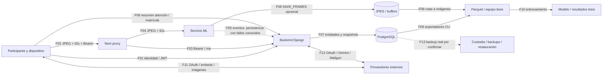

# P0.2 — Inventario, amenazas e impacto de privacidad

Fecha inicial: 2026-09-07. Corrección de alcance: 2026-09-12 (America/Guayaquil). Commit: `7f8f9cb987779b6e4df417b3195040a7b4b7dc60`. Estado: **preparado para revisión; controles propuestos pendientes de implementación y validación**.

**Conclusión:** VisionClass procesa datos personales vinculados a identidad, imágenes y perfiles de atención/rendimiento. No corresponde describir el flujo como anónimo. Los fallos de permisos de P0.1, controles de consentimiento incompletos, tratamiento secundario de investigación y ausencia de un ciclo de supresión verificable dejan riesgos altos/críticos. Se propone no iniciar nueva captura real del estudio hasta resolver los bloqueos definidos aquí. La auditoría no cambia ni detiene servicios.

El usuario corrigió y confirmó durante P0.2: **operador: un tesista; país de participantes: Ecuador; población: estudiantes universitarios mayores de edad (18 años o más); no se usarán datos de menores**. Quedan abiertos universidad/entidad, responsable jurídico, tutor, mecanismo de comprobación de elegibilidad, tamaño de muestra, protocolo y despliegue efectivo. No se asume que el tesista sea automáticamente el responsable jurídico único.

La condición de universitario no se usa como prueba automática de mayoría de edad. Se propone comprobar elegibilidad (18 años o más) antes de recoger datos del estudio, con evidencia mínima. La indicación anterior sobre participación de menores fue corregida expresamente por el usuario y queda sustituida por este alcance.

## 1. Método y entregables

Se revisaron primero estado de Git, instrucciones y documentación. Estado inicial: commit de P0.1 con `?? docs/`; no había AGENTS.md en repo ni directorios superiores. Durante la revisión final apareció un **AGENTS.md nuevo, ajeno a esta tarea**: se leyó y aplicó, sin editarlo. No se encontraron overrides aplicables ni un plan de ejecución separado. Se conservaron todos los documentos anteriores, incluido P0.1. Se tomaron hashes de los **208 archivos seguidos por Git o preexistentes en docs/** antes de escribir; la comprobación final consta en `VERIFICACION.json`.

Conforme al nuevo AGENTS.md se creó la rama `p02-inventario-amenazas-privacidad` desde main, tras `git fetch origin --quiet` y comprobar que main y origin/main no tenían divergencia (0/0). No se hizo commit, push ni PR. El alcance sigue siendo P0.2; no se presume aprobación de P0.1–P0.5, G0 ni G3. Rollback del entregable: retirar únicamente los nuevos archivos de `docs/P0.2/` si se descartan; no afecta comportamiento, datos ni documentos previos.

Se inspeccionaron modelos, serializers/querysets, captura/proxy/ML, persistencia duplicada de métricas, exportadores, entrenadores, secretos/configuración, páginas de privacidad y despliegue. No se leyeron valores de `.env` privados, BD, fotos de participantes ni credenciales. No se hicieron peticiones a endpoints VisionClass ni se enviaron correos. No se ejecutaron instalaciones, migraciones, borrados o pruebas productivas: P0.2 añade solo documentación y evidencias estáticas.

- **E:** evidencia estática localizada en este commit; no garantiza configuración real del servicio.
- **V01:** comportamiento reproducido en P0.1, con evidencia preservada; no se presenta como nueva prueba P0.2.
- **I:** escenario de riesgo/inferencia a validar; **Q:** dato operativo/legal pendiente.
- **P:** propuesta concreta, no control existente. Riesgo residual actual no baja por escribir una propuesta.

Entregables:

- [Inventario D01–D16 y acceso interno](INVENTARIO_DATOS.md): capturados, derivados, almacenados, exportados, eliminación y destinatarios.
- [Ciclo de vida y protocolo de participación de adultos](CICLO_DE_VIDA.md): calendario propuesto, revocación, supresión, backups/restauración y participación en tesis.
- [Esquema extraído de modelos](esquema-modelos.json): 18 modelos / 119 campos explícitos, sin datos de personas.
- [Trazabilidad de controles](trazabilidad-controles.json): referencias a switches de privacidad, políticas/investigación y ciclo ML; posiciones de código.
- [Evidencia de P0.1](../P0.1/sondas-resultados.txt): privilegios/edición de cursos y contrato ML. No hubo cambios en esos fuentes.

## 2. Marco de la evaluación de impacto

La LOPDP exige evaluación previa cuando el tratamiento probablemente implique alto riesgo (art. 42); regula consentimiento y revocación (art. 8). Esta evaluación técnica identifica riesgos y decisiones, pero necesita validación del responsable institucional para constituir su evaluación formal. [LOPDP, fuente SPDP](https://spdp.gob.ec/wp-content/uploads/2024/12/03.pdf.pdf).

Se verificó que el Registro Oficial publicó la segunda versión de la guía SPDP mediante resolución 2026-0012-R el 30-03-2026; no se usa la guía 2025 como si fuera la única referencia. La descarga completa de la guía V2 falló en la herramienta, por lo que **no se afirma conformidad íntegra con su metodología**. La escala de §5 es propia y cualitativa. [Registro Oficial, suplemento 254](https://www.registroficial.gob.ec/suplemento-no-254/).

La SPDP también identifica regulación específica de IA en 2026. La revisión de aplicabilidad y reformas, transferencias internacionales, contratos, designación de DPD y revisión ética queda asignada a privacidad/jurídico de la entidad por determinar; no se deducen del país del servidor ni del carácter de tesis. [SPDP, comunicación sobre IA](https://spdp.gob.ec/prensa/).

Consulta de fuentes oficiales: 2026-09-07. No se han revisado contratos reales ni emitido certificación jurídica. Reglas de edad contextualizadas en [ciclo de vida §5](CICLO_DE_VIDA.md).

### Finalidades, necesidad y proporcionalidad

| Tratamiento / datos | Finalidad observada | Evaluación de necesidad y alternativa propuesta | Determinación pendiente |
|---|---|---|---|
| Identidad/matrícula D01/D02 | Acceso, rol y vinculación educativa | IDs de estudio y datos mínimos; justificar teléfono/carrera/semestre/notas y duplicación de nombre/email. No trasladar expediente completo a investigación | Separar cuenta institucional de participante de tesis; base de tratamiento por finalidad |
| Cámara/rasgos D04/D05 | Estimación de atención por mirada/ojos/rostro | La funcionalidad actual requiere imagen, pero no demuestra necesidad de captura remota. AGENTS.md exige **procesamiento local sin salida de frames/imágenes/audio/blobs en modo predeterminado**. Evaluar sesión acotada, rasgos mínimos autorizados o evaluación sin cámara | Hipótesis, frecuencia/duración y alternativa menos intrusiva; la auditoría no autoriza excepciones de transmisión de material crudo |
| D2R y seguimiento D06–D10 | Prueba, progreso, personalización, riesgo de abandono | Separar medición experimental de decisiones educativas. CON no es percentil poblacional; área de rostro/gaze no demuestra atención cognitiva | Validación por población/condiciones, unidades, errores, accesibilidad y explicación al participante |
| Investigación/modelos D13 | Entrenamiento con etiquetas derivadas de D2R | Finalidad secundaria separada. Seudonimizar por proyecto, retirar nombres/IDs operativos, minimizar ventanas/frames y evitar transferencia si el análisis puede hacerse localmente | Protocolo, autorización por propósito, custodia, receptor, expiración y publicación de resultados |
| Mensajes/proveedores D03/D11/D14 | Notificar, generar preguntas y servir contenido | Evitar resultados detallados por email; excluir notas personales del prompt; alternativa de contenido local sin embeds | Contratos, regiones, soporte, retención, transferencias y uso de datos por cada proveedor |

La base jurídica de cada finalidad **no está probada por el repositorio**. Un permiso de cámara del navegador, aceptar términos al usar el sitio, un switch local o una solicitud ética aprobada no son por sí solos evidencia suficiente de autorización informada para todos los usos. El protocolo debe recoger también la opinión de participantes y revisión del tutor; esas consultas no se realizaron en esta tarea.

## 3. Límites de confianza y flujos

| Frontera | Activos y validación actual | Implicación / objetivo propuesto |
|---|---|---|
| TB1 Dispositivo ↔ aplicación | F01/F02/F06: JWT; permisos getUserMedia; formulario e IDs controlados por cliente. Captura curso ≈1 Hz y D2R ≈2 Hz. HTTPS declarado en Render, HTTP local en Compose | El dispositivo y su contenido no son confiables. Vincular identidad/sesión/finalidad en servidor; minimizar imagen, tamaño/frecuencia; proteger contra reutilización de credenciales |
| TB2 Next ↔ Django/ML | F03 comprueba rol student en `/me/`; F04 reenvía formulario sin verificar pertenencia de IDs y sin credencial de ingesta hacia ML | Pasar del proxy no acredita autorización sobre los IDs. ML puede ser accesible directamente según despliegue; el control de red real es Q |
| TB3 ML ↔ Django | F05 prepara JWT técnico pero no lo adjunta; sin BACKEND_TOKEN retorna sin persistir. F06 puede guardar resúmenes por otra vía | Reparar solo el header puede activar persistencia con IDs no confiables. Revisar auth/pertenencia/minimización conjuntamente |
| TB4 Procesos ↔ almacenamiento | F07/F08: JSON/BinaryField, filesystem y RAM. Buffers/dirs ML usan solo ID entero compartido por COURSE/D2R | Cifrado de disco/IAM reales Q. Namespace y TTL por sesión, límites de lectura/escritura y separación de claves |
| TB5 Plataforma ↔ equipo de investigación | F09/F10 salen de controles DRF; quien tenga DB/CLI/archivos puede exportar | Solicitud ResearchAccessRequest no limita los comandos. Control por proyecto, custodia y linaje, no por confianza informal en el operador |
| TB6 Organización ↔ proveedores | F11/F12: identidad, contenido/prompts, email, metadatos de navegación | Roles contractuales, región/transferencias y acceso soporte deben verificarse por servicio; software open source local no equivale a transferencia de frames a su autor |
| TB7 Operadores/CI ↔ todo el sistema | Credenciales, imágenes, consola, logs y F13 | Acceso de administración elude roles del producto. Custodio, MFA, auditoría, separación de funciones y recuperación sin resucitar datos retirados |

### Proveedores y acceso externo

| Proveedor / componente | Flujo realmente identificado | Datos y condición | Pendientes de diligencia |
|---|---|---|---|
| Google OAuth | F11/F12 login code/token y perfil | Identidad y contexto de autenticación; configuración de Client ID/secret/callback | Cuenta/proyecto del responsable, scopes efectivos, tokens guardados, retención/soporte |
| Google Gemini | `GenerateTestView`: google.genai, gemini-2.5-flash cuando GOOGLE_API_KEY existe | Contexto de módulos/materiales/PDF/transcripciones y notas docentes. No se encontró envío automático de imágenes de cámara ni expediente íntegro. PII en texto libre es I | Contrato y configuración de uso/retención de prompts, minimización previa, región y transferencias. Docstring menciona OpenAI, pero este camino ejecuta Gemini |
| Mailgun y correo del receptor | `utils.py`, notificación de matrícula/D2R/docente | Dirección, remitente, asunto y texto; D2R incluye puntuaciones | Dominio/endpoint real, logs/copias, subencargados, borrado, contenido mínimo, TLS efectivo |
| YouTube / imágenes externas como Unsplash | Embeds frontend, extracción de transcripciones backend, ImageWithFallback con URL externa | URL de material; IP/agente/referer potenciales al cargar recursos en navegador (I). Transcripción puede persistirse en metadata | Inventario por material, consentimiento/aviso y política de cookies efectiva, alternativa local. No se ha medido tráfico/cookies |
| Render | YAML para app/ML/Postgres | BD, env, logs y tráfico si es despliegue elegido | Tenant, región, backups, permisos soporte, contratos y proveedores secundarios reales |
| Google Cloud | Guía Cloud Run/SQL/Secret Manager, Cloud Build/Artifact Registry | Imágenes, logs, env/secretos y datos si se despliega; guía usa us-central1, no prueba ubicación real | Titular de cuenta, IAM, facturación, región aprobada, transferencias, custodia al terminar tesis |
| PyPI/npm/registro base y pesos torchvision | Instalación/build y descarga de pesos en entrenamiento | Cadena de suministro; no transmisión de datasets observada por ese mero uso | Versiones/hashes, permisos CI, ausencia de datos/secretos en contexto build, revisión de dependencias |

No se asume que los datos se usen para entrenar modelos de proveedores: se debe verificar contrato/configuración. MediaPipe/OpenCV/ONNX en `ml_service.py` procesan localmente; la marca Google de MediaPipe no demuestra salida de frames a Google.

### Flujo de secretos

| Secreto / dato público | Origen → consumidor y uso | Estado / propuesta |
|---|---|---|
| Password participante | Formulario HTTPS esperado → Django set_password; hash DB | No registrar cuerpos; credenciales del estudio separadas; probar alta/cambio y revocación. No incluir password en archivos de auditoría |
| SECRET_KEY / firma JWT | Env backend; default inseguro si falta. Render generateValue; guía Secret Manager | Sin clave de firma JWT independiente en settings inspeccionado. Custodia y rotación con análisis de sesiones/tokens emitidos; nunca NEXT_PUBLIC_* |
| Access/refresh | Django → navegador; access a localStorage → Bearer backend/proxy. Refresh devuelto pero UI lo descarta | Logout local no invalida las copias. Evitar logs de tokens; diseñar revocación de ambos y responder a pérdida de dispositivo |
| GOOGLE_OAUTH_CLIENT_SECRET | Configuración privada → backend/allauth → proveedor OAuth | ID/redirect URI del frontend son públicos. State/redirect y logs deben revisarse. No confundir client ID con secreto |
| BACKEND_TOKEN / ML_BACKEND_TOKEN | Comando crea usuario y token → env ML, Compose traduce variable; GCP Secret Manager en guía | Cuenta por defecto superusuario; comando imprime contraseña/access; header de ingesta omitido. Necesita mínimo privilegio, caducidad y rotación al terminar estudio |
| DB_PASSWORD / DATABASE_URL | Env/backend o integración cloud → conexión DB | Contienen credencial; defaults de desarrollo en repo. Sin dump de env en logs; acceso red y cifrado efectivos Q |
| MAILGUN_API_KEY / GOOGLE_API_KEY | Env backend → API externa | Proyectos institucionales/restringidos, cuotas y control de quién puede generar/envíar; baja/rotación al cambiar tesista |
| Credencial CI/cloud/backup | Fuera del repo/Secret Manager o consola, identidad efectiva Q | Inventario por persona/servicio, MFA, separación backup/clave, rotación ante incidente/salida y prueba de revocación |
| NEXT_PUBLIC_BACKEND_URL, ML_URL, GOOGLE_CLIENT_ID | Build frontend → bundle público | Son configuración pública. No poner secretos; secretos locales podrían entrar en imagen por COPY . . sin .dockerignore (I) |

No se mostraron ni recopilaron valores privados. Los permisos reales de repositorio, consola, DB, equipo del tesista y respaldos siguen por verificar.

## 4. Hallazgos de privacidad nuevos y relación con P0.1

1. **E — Avisos incompatibles con el modelo de datos.** `PrivacySection.tsx` afirma métricas anonimizadas y `CameraPermissionModal.tsx` afirma ausencia de PII/datos sensibles y de almacenamiento de imágenes. Existen identidad, matrícula, FK user/session, perfiles inferidos y SAVE_FRAMES. El aviso de retención/backups/cifrado en `SecuritySection.tsx` tampoco acredita controles de operación. Es necesario corregir promesas tras decidir el tratamiento, no aprobarlas como evidencia.
2. **E — Switches no gobiernan el tratamiento completo.** En curso, enableCamera inicia captura cada segundo. `sendFrame` no comprueba enableAttentionTracking/saveAnalytics/shareWithInstructor; esas últimas opciones aparecen en estado/presentación, sin control servidor identificado. Se envía además atención agregada mediante PATCH enrollment_data. El permiso navegador no comunica esas finalidades al backend ni a investigadores.
3. **E — Control administrativo declarativo.** PrivacyPolicySetting se usa para guardar/mostrar valores; no hay lectores que impongan TTL, anonimización o granularidad en ingesta/exportadores identificados. ResearchAccessRequest aprobado no es requisito en los comandos de exportación. No hay consentimiento por participante/versionado en los modelos propios.
4. **E/I — Revocación incompleta de captura.** `requestCamera` obtiene un MediaStream adicional y no conserva/detiene ese resultado. `stopCamera` detiene los tracks del video conocido; comprobar en navegador si el stream adicional mantiene la cámara activa. No se afirma fuga reproducida; sí ausencia de una gestión explícita de ese recurso.
5. **E — Perfiles nominativos.** `_dropout_prediction` retorna nombre/ID/riesgo/factores basados en una fórmula heurística; no evidencia validación predictiva. D2R usa CON como attention_span y calcula un supuesto percentil con media×100. Esto puede afectar a participantes aunque no haya atacante ni brecha de seguridad.
6. **E — Borrado relacional insuficiente.** Hay derivados en matrícula, reportes, correos, exports y archivos ML. No hay proceso que los recorra por participante. Cascadas y SET_NULL tienen consecuencias distintas, incluido borrar cursos de otros alumnos al eliminar su propietario.
7. **V01/E — Autorización insegura conservada.** Alta anónima admin, PATCH del propio rol y edición de curso ajeno por student fueron reproducidos en P0.1. Son barreras críticas para custodiar datos de tesis. Se verificó que el código no cambió; las sondas no se repitieron sobre datos reales.
8. **E — Brecha frente a AGENTS.md incorporado durante P0.2.** El flujo actual transmite JPEG al proxy/ML. La regla de repositorio exige que no salga material crudo en el modo predeterminado; consentimiento ausente, revocado o expirado debe cerrar la captura. Cifrar o autenticar los JPEG no satisface esa regla. El objetivo posterior debe ser cómputo local y envío solo de características/eventos autorizados, con prueba negativa de red/telemetría. No se entrenará ni promocionará ML antes de G3.

## 5. Modelo de amenazas y priorización

Actores: externo sin cuenta; participante con cuenta; docente con acceso excedido; tesista/operador o investigador autorizado que usa datos fuera de finalidad; intruso con credencial; proveedor comprometido; error operativo/restauración; malware en equipo de tesis. Activos: identidad/secretos, privacidad del participante y terceros, integridad de resultados, disponibilidad y autonomía para participar/retirarse.

Método: escenarios por frontera y categorías **STRIDE** (suplantación, manipulación, repudio, divulgación, indisponibilidad y elevación de privilegios), ampliados con riesgos de privacidad aun bajo acceso autorizado. Escala propia: probabilidad **P=1** exige condiciones poco plausibles o controles comprobados; **2** escenario plausible con condición operativa pendiente; **3** camino presente sin control efectivo o fallo reproducido. Impacto **I=1** limitado/reversible; **2** exposición o perjuicio acotado; **3** exposición de imágenes o perfiles personales vinculados, privilegios amplios, daño académico/identidad o pérdida importante. Producto P×I: **9 crítico; 6 alto; 3–4 medio; 1–2 bajo**. No es una probabilidad estadística ni una métrica SPDP certificada. Incertidumbre de despliegue no se interpreta como ausencia de riesgo.

En la tabla, “actual” incorpora solo controles comprobados; “meta” es residual **esperado después** de implementar y verificar, no riesgo reducido hoy. Todos los escenarios permanecen abiertos.

| ID / fronteras / categoría | Escenario y evidencia; impacto en participantes | Actual → meta | Mitigación y criterio verificable posterior | Responsable sugerido |
|---|---|---|---|---|
| T01 TB1/TB7, S/E/I | Externo se registra admin o participante eleva su rol y accede a datos sensibles; V01, serializers/UserViewSet/MeView | 3×3=9 crítico → 1×3=3 | Roles asignados solo por operador autorizado; pruebas negativas de alta/perfil y todos los endpoints admin, tokens antiguos incluidos | Backend + seguridad |
| T02 TB1/TB4, T/I | Student modifica curso ajeno (V01); usuarios autenticados enumeran identidades; docente ve D2R/notificaciones de alumno más allá del contexto esperado (E/I) | 3×3=9 crítico → 1×3=3 | Matriz sujeto/rol/curso/finalidad/vigencia para CRUD y FK; pruebas cruzadas con dos docentes y alumnos, incluidas matrículas canceladas | Backend + tutor + QA |
| T03 TB2/TB3, S/T/D | Formulario sustituye IDs; ML directo no autentica. Reparar header puede permitir eventos atribuidos a otro alumno; frames no acotados consumen CPU/RAM (E/I) | 2×3=6 alto → 1×3=3 | El modo predeterminado ingiere solo rasgos/eventos autorizados tras cómputo local; credencial mínima, pertenencia/finalidad, límites de cuerpo/tasa y rechazo de material crudo; pruebas contra todos los caminos | ML + backend + plataforma |
| T04 TB1/TB5, privacidad/autonomía | Participante permite cámara creyendo anonimato o desactiva guardar/compartir, pero se procesan rasgos y persisten resúmenes; avisos/switches y ausencia de registro servidor (E) | 3×3=9 crítico → 1×3=3 | Aviso veraz y comprensible, autorización por finalidad, mecanismo de retirada efectivo en todos los destinos; comprobar cero nuevos datos/exports tras revocar | Producto + privacidad + frontend/backend |
| T05 TB5, I/uso secundario | Tesista o receptor exporta Parquet con user_id/paths y lo publica/comparte como anónimo; cohorts pequeñas y rostros permiten reidentificar (E/I) | 3×3=9 crítico → 1×3=3 | Proyecto/permiso separado, seudónimos/mapa custodiado, minimizar columnas, revisar publicación y registrar destinatarios; revisión de riesgo de reidentificación por dataset | Tesista + tutor + custodio |
| T06 TB1/TB4, perfilado | Heurísticas convierten ausencia de rostro/iluminación/distancia/mirada en baja atención y riesgo de abandono; docente puede etiquetar o penalizar al estudiante (E/I) | 2×3=6 alto → 1×3=3 | Sin decisiones adversas automatizadas; separación experimental/académica, revisión humana e impugnación; evaluar errores por condiciones y accesibilidad | Tutor + especialista en medición + privacidad |
| T07 TB4, T/I/D | IDs COURSE/D2R coincidentes mezclan ventanas/directorios; buffers sin TTL crecen o conservan rasgos tras retirada (E/I) | 2×3=6 alto → 1×3=3 | Clave compuesta y TTL/borrado por sesión/sujeto; prueba simultánea con mismos IDs, fin/revocación/reinicio y consumo acotado de memoria | ML + QA |
| T08 TB1/TB7, S/I | Malware/XSS roba access en localStorage; logout no invalida copia; cuenta ML superusuario o secretos impresos amplían impacto (E/I) | 2×3=6 alto → 1×3=3 | Sesión/revocación probada, credenciales limitadas, sin impresión/log de secretos, respuesta a equipo perdido; validar token viejo tras baja/incidente | Seguridad + tesista + plataforma |
| T09 TB6/TB7, I | COPY . . incorpora .env/datasets presentes al build; logs registran email/score/código OAuth; registry o consola expone datos (E/I, no fuga observada) | 2×3=6 alto → 1×3=3 | Contextos permitidos, revisión de imágenes/logs con señuelos sintéticos, accesos mínimos y redacción. Gitignore no basta | Plataforma + seguridad |
| T10 TB6, I/transferencia | Material/nota contiene PII enviada a Gemini; correo distribuye resultados; embeds exponen navegación fuera de la entidad (E/I) | 2×3=6 alto → 1×3=3 | Registro de servicios/contratos/configuración, región y retención verificadas; filtro/minimización de contenido, alternativas locales, prueba de tráfico sintético | Responsable + privacidad + backend |
| T11 TB4/TB5/TB7, privacidad | Se atiende borrado de cuenta/eventos pero quedan resúmenes, snapshots, imágenes, datasets/modelos o copias del investigador (E/I) | 3×3=9 crítico → 1×3=3 | Linaje por participante, inventario de todas las copias y workflow idempotente; solicitud sintética con evidencia por destino y excepciones justificadas | Custodio + backend + ML |
| T12 TB7/F13, T/D/privacidad | Restauración reactiva datos/autorizaciones retiradas; pérdida o ransomware deja estudio sin recuperación; backups no documentados (Q/I) | 2×3=6 alto → 1×3=3 | Backups cifrados/caducidad/custodio, registro de supresiones independiente; ensayo restore que cumpla RPO/RTO y no reintroduzca sujetos retirados | Custodio backups + tutor |
| T13 TB7, R | Cambios privilegiados, entregas de dataset o alteración de resultados no tienen trazabilidad suficiente; logs debug no son auditoría de accesos (E/I) | 2×3=6 alto → 1×3=3 | Auditoría mínima de actor/acción/recurso/finalidad/fecha/resultado; acceso protegido, entrega por recibo y conciliación sin payloads sensibles | Seguridad + custodio |
| T14 TB4/TB5, T/D | Borrar docente elimina cursos de otros alumnos por CASCADE; limpieza baseline se usa erróneamente como eliminación de participante (E/I) | 2×3=6 alto → 1×3=3 | Inventario/previsualización de dependencias, transferencia de propiedad o política aprobada, prueba de borrado con otros alumnos preservados | Backend + responsable académico |
| T15 TB5/TB7, T/I | Equipo personal/cuenta personal del tesista se pierde o al finalizar tesis quedan datasets, claves y control exclusivo; cadena de suministro/modelo no verificados (Q/I) | 2×3=6 alto → 1×3=3 | Custodia institucional y separación de entornos, disco cifrado, no sincronización personal, manifest/versiones de artefactos, acta de traspaso/baja y revocación al cierre | Tesista + tutor + plataforma |

La exclusión de menores retira representación y asentimiento del alcance activo. Se revisaron las prioridades y se mantienen por exposición de datos vinculados, privilegios, autonomía y posible daño académico a adultos; no se apoyan ahora en vulnerabilidad por minoría de edad. Las metas se deben recalcular después de pruebas y con tamaño de muestra, características de la población adulta y destinos reales; **no son garantía de aceptabilidad jurídica o ética**. Si subsiste riesgo alto/crítico, documentar alternativas, responsables y decisión de no iniciar/ampliar ese tratamiento. No se ha identificado ni investigado un incidente real.

## 6. Impacto de privacidad y decisión provisional

| Dimensión | Consecuencia plausible para personas | Controles actuales comprobados | Residual actual / respuesta propuesta |
|---|---|---|---|
| Transparencia y voluntad | Participante cree que no hay imágenes ni identidad; participación bajo presión académica | UI de permiso y opción continuar sin cámara en cursos; permiso navegador; no registro por finalidad | Crítico T04: aviso y protocolo específico, alternativa sin penalización y prueba técnica de opt-out |
| Intimidad y terceros | Imagen del hogar/convivientes y rasgos vinculados al participante | Audio desactivado en captura de curso, SAVE_FRAMES default 0 | Alto: el JPEG completo sigue transmitiéndose para analizar; minimizar encuadre/ventana y justificar guardar original |
| Exactitud y trato justo | Score erróneo afecta reputación, expectativas docentes o seguimiento académico | Heurísticas/fallback y roles de panel; no validación poblacional inspeccionada | Alto T06: supervisión, derecho a explicación/impugnación, no uso sancionatorio y separación de experimento |
| Confidencialidad y asociación | Cruce identidad/D2R/curso/horarios o publicación reidentifica al participante | JWT/filtros parciales; export ID vinculable | Crítico T01/T02/T05: autorización probada y revisión de anonimización/publicación |
| Control y retirada | Datos reaparecen o continúan compartiéndose tras petición | Cascadas/edición perfil/logout local | Crítico T11: tratamiento por finalidad, linaje, purga de derivados y seguimiento externo |
| Disponibilidad y custodia | Pérdida de expediente/estudio o recuperación expone datos | Volumen DB y manifiestos cloud, sin backup acreditado | Alto T12/T15: recuperación medida y traspaso del tesista con custodia separada |

**Valoración:** el contexto confirmado de investigación con estudiantes universitarios adultos, monitorización visual, perfiles nominativos y brechas de autorización requiere evaluación institucional previa al uso real. Este documento proporciona la parte técnica y una propuesta de medidas. No hay base para afirmar “datos anónimos”, “consentimiento implementado” o “retención aplicada”. No se ha consultado aún a tutor, comité, participantes; recoger sus observaciones forma parte del cierre formal.

La propuesta de [ciclo de vida](CICLO_DE_VIDA.md) define expresamente backups, revocación, retención, supresión de derivados, modelos y elegibilidad de participantes adultos; ningún plazo fue aplicado. Ante un posible incidente: suspender el flujo afectado, preservar evidencia mínima con acceso restringido, revocar credenciales comprometidas, delimitar sujetos/destinos y escalar de inmediato a responsable/privacidad para determinar comunicaciones y plazos aplicables. No enviar datos personales de participantes por canales informales para investigar.

## 7. Decisiones, responsables y evidencias exigidas

Los responsables siguientes son **roles sugeridos**. El usuario confirmó un tesista, no una estructura institucional existente. Evitar que una sola persona sea a la vez quien autoriza, exporta y certifica borrado sin revisión.

| Decisión | Quién debe resolver | Resultado versionable necesario |
|---|---|---|
| D01 Gobierno del estudio | Tesista + tutor + institución por identificar | Nombre de entidad/responsable, roles, contacto de derechos, responsable de privacidad/DPD según corresponda, custodia y traspaso al cerrar tesis |
| D02 Protocolo y elegibilidad | Tutor + revisión ética/institucional + privacidad | Finalidad/hipótesis, criterio de 18 años o más, muestra, reclutamiento, consentimiento directo del adulto y comprobación proporcional de elegibilidad y alternativa sin cámara; aprobación de protocolo y versión de avisos |
| D03 Necesidad y uso de resultados | Tutor + especialista en medición | Qué datos/cadencia son necesarios, validación de métricas, límites y prohibición de consecuencias académicas adversas automáticas |
| D04 Autorización y privacidad técnica | Backend + frontend + ML + seguridad | Matriz de acceso/destinos por finalidad, contrato de IDs/ingesta, revocación/secretos y pruebas negativas; priorizar T01–T04 |
| D05 Retención y eliminación | Custodio + privacidad + tutor | Calendario ratificado por categoría, excepciones/plazos aplicables, linaje y registro de entrega/borrado/modelos |
| D06 Infraestructura/proveedores | Custodio + plataforma + privacidad | Despliegue elegido, cuentas institucionales, IAM/red/región, contratos/transferencias, backup/RPO/RTO y soporte |
| D07 Publicación y cierre | Tesista + tutor + responsable | Tabla de entregas permitidas, revisión de reidentificación, plan de publicación de tesis, expiración de datasets y acta de revocación/traspaso |

Plan de verificación posterior, sin implementación en P0.2:

- **PV0 / elegibilidad:** solo universitarios de 18 años o más; casos sintéticos adulto elegible, menor y elegibilidad no confirmada. En los dos últimos, cero captura, eventos o inclusión en dataset. El control está propuesto, no implementado.
- **PV1 / T01–T03:** cuentas sintéticas de dos docentes/dos estudiantes y actor anónimo; negativos de rol/CRUD/FK/listado y ambos caminos de ingesta. Cero acceso cruzado no autorizado; ML público/directo no elude controles.
- **PV2 / T04/T07/T08:** todas las combinaciones de permisos, incluida ausencia/expiración; al negar seguimiento/guardado/compartir no salen ni persisten datos fuera del alcance. Prueba negativa de red, telemetría y reporte de errores: **cero material crudo sale del dispositivo en modo predeterminado**. Revocar detiene tracks conocidos/adicionales, buffers, solicitudes tardías y futura exportación; tokens antiguos probados tras baja/incidente.
- **PV3 / T05/T10:** dataset/prompt/correo sintético con señuelos; verificar columnas/campos mínimos, receptores autorizados y ausencia de identificadores operativos/secretos donde estén prohibidos. Cohortes pequeñas y publicación revisadas por privacidad.
- **PV4 / T11/T12/T14:** crear sujeto sintético con matrícula, eventos, snapshots, exports/frames, notificaciones y backup; borrar/retirar y restaurar. No reaparece el alcance suprimido y no se destruyen datos ajenos; evidencia por destino y límites externos comunicados.
- **PV5 / T06:** evaluación del indicador con protocolo y población definida, condiciones de iluminación/cámara y necesidades de accesibilidad; umbrales de calidad acordados antes de analizar y canal de impugnación. No inventar precisión esperada sin experimento.
- **PV6 / T09/T13/T15:** imágenes/logs sin señuelos secretos, revisión de permisos de consola/disco/registry, auditoría verificable y ensayo de transferencia de custodia al cerrar tesis.

### Adenda de decisiones G0 — 2026-09-14

El registro saneado [DECISIONES_G0_SANITIZADAS.json](../G0/DECISIONES_G0_SANITIZADAS.json) asigna ejecución y custodia a `tesista_operador` y clasifica D01–D07. Quedaron decididos los usos prohibidos, consentimiento separado, alternativa sin cámara, acceso mínimo, revocación operativa, publicación agregada y los plazos técnicos salvo consentimiento/retirada. ESPE y Render son propuestas: entidad responsable, canal institucional, región, contrato, backup y restore requieren ratificación externa. La revisión P0.2 es **APROBAR CON CORRECCIONES** y no sustituye aprobación ética o institucional.

## 8. Criterios objetivos para aprobar P0.2

**Completitud del entregable de análisis:**

- [x] Commit, método, conservación y contexto confirmado (tesista/Ecuador/universitarios adultos; menores excluidos) registrados.
- [x] Categorías D01–D16 clasifican captura, derivados, almacenamiento, destinatarios, exportación y eliminación; modelos y referencias anexos verificables.
- [x] Fronteras TB1–TB7, flujos F01–F13, secretos, proveedores y acceso interno diferenciados entre existente, inferido y propuesto.
- [x] Escenarios T01–T15 con prioridad calculable, afectados, dueño y criterio de mitigación; evaluación de impacto contempla participantes adultos, exclusión de menores y daño sin atacante.
- [x] Propuesta de retención, revocación, backups/restore, eliminación de derivados/modelos y exclusión de menores; tiempos no presentados como ley o configuración vigente.
- [x] Ninguna funcionalidad/configuración productiva alterada; evidencias y enlaces locales verificados.

**Cierre/aprobación del informe por sus responsables:**

- [ ] Tesista y tutor identifican responsable/custodio y aceptan o corrigen el inventario de propósito, edades, datos y proveedores; se registra fecha/versión y quién revisó.
- [ ] Responsable/privacidad valida base por finalidad, criterios de elegibilidad adulta y consentimiento, normativa aplicable, metodología formal de EIPD, revisión ética y alcance de transferencias.
- [ ] D01–D07 tienen persona responsable, decisión o hito/fecha de resolución; cada T tiene tarea de tratamiento asociada. Pendientes no se cierran por silencio.
- [ ] Se ratifica calendario y plan de verificación PV0–PV6, dejando explícito qué bloquea reclutamiento/captura/publicación y quién puede liberar cada bloqueo con evidencia.

La aprobación de **P0.2 como análisis** no requiere implementar aquí PV0–PV6 ni arreglar el producto. La autorización para iniciar el estudio real es otra decisión: requiere resolver riesgos críticos, probar controles de elegibilidad, consentimiento y revocación y aceptar formalmente el residual recalculado. No se solicita aprobar una publicación o despliegue en esta tarea.

## 9. Límites y preguntas abiertas

La edad mínima está fijada en 18 años; faltan método de verificación, tamaño de muestra e identidad de universidad, tutor o responsable; no hay contratos/IAM/región/backup reales revisados; no se inspeccionó esquema físico ni volumen de datos, tráfico/cookies reales, paquetes OAuth en ejecución ni distribución de datasets existentes. El contenido real del JPG diagnóstico no fue examinado ni clasificado como imagen de participante. No se acredita ausencia global de datos porque una búsqueda de código no los encuentre.

No se repitieron lint/build: solo cambiaron artefactos de documentación. Las comprobaciones P0.2 son esquema por AST, referencias cruzadas de controles, enlaces internos, hashes y preservación de fuentes/evidencias anteriores. Cualquier cambio de finalidad, edad, proveedor, modelo, captura, plazo o publicación debe activar revisión de este inventario y evaluación.
