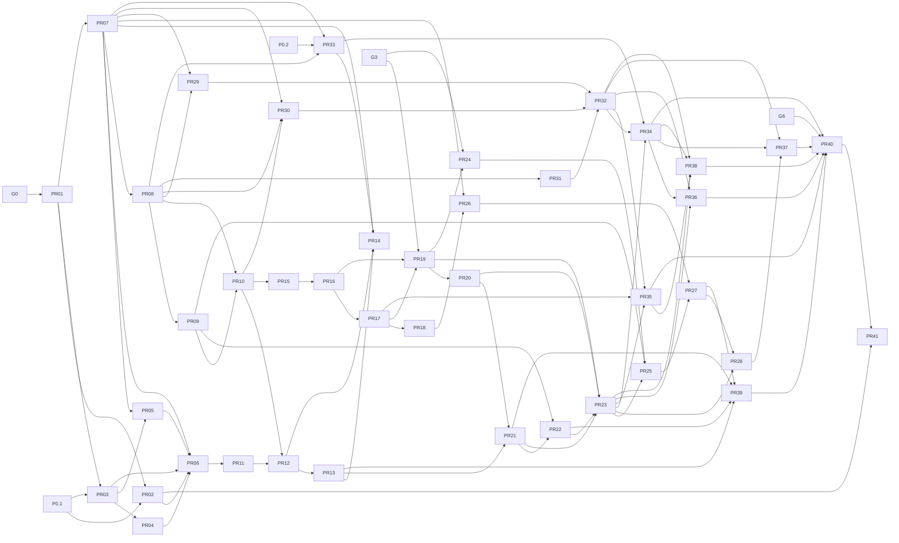

# Grafo de dependencias de VisionClass

**Estado:** alcance importado y verificable; no constituye aprobación de gates.

La secuencia aprobada en `AGENTS.md` controla el orden de ejecución:

`G0 → PR01 → PR03 → PR07 → PR02 → PR04 → PR05 → PR06 → G1 → PR08 → PR09 → PR10 → PR29 → PR30 → PR31 → G2 → PR11 → PR12 → PR13 → PR33 → PR14 → PR15 → PR16 → PR17 → PR18 → G3 → PR19 → PR20 → PR21 → PR22 → PR23 → PR24 → G4 → PR25 → PR26 → PR27 → PR28 → PR32 → PR34 → G5 → PR35 → PR36 → PR37 → PR38 → PR39 → G6 → PR40 → PR41`

Las aristas siguientes reflejan únicamente identificadores explícitos en el plan fuente. Las condiciones metodológicas, éticas y operativas conservadas en la tabla también son prerrequisitos.

## Dependencias literales de la fuente

| PR | Ola | Prerrequisito fuente |
| --- | --- | --- |
| PR01 | Ola 1 Arquitectura identidad y consentimiento | Puerta G0 aprobada |
| PR02 | Ola 2 Base segura observable | PR01 y el inventario de dependencias D2R de P0.1 |
| PR03 | Ola 1 Arquitectura identidad y consentimiento | PR01 y el mapa de autenticación de P0.1 |
| PR04 | Ola 2 Base segura observable | PR03 |
| PR05 | Ola 2 Base segura observable | PR03 y PR07 |
| PR06 | Ola 2 Base segura observable | PR02, PR03, PR04, PR05 y PR07 |
| PR07 | Ola 1 Arquitectura identidad y consentimiento | PR01 y aprobación inicial de privacidad, ética y tratamiento de participantes |
| PR08 | Ola 3 Datos contratos e instrumentos | PR07 |
| PR09 | Ola 3 Datos contratos e instrumentos | PR08 |
| PR10 | Ola 3 Datos contratos e instrumentos | PR08 y PR09 |
| PR11 | Ola 4 Estado distribuido retención y bóveda | PR06 |
| PR12 | Ola 4 Estado distribuido retención y bóveda | PR10 y PR11 |
| PR13 | Ola 4 Estado distribuido retención y bóveda | PR12 |
| PR14 | Ola 4 Estado distribuido retención y bóveda | PR07, PR12, PR13 y PR33 |
| PR15 | Ola 5 Edge calidad y preparación de datos | PR10 |
| PR16 | Ola 5 Edge calidad y preparación de datos | PR15 |
| PR17 | Ola 5 Edge calidad y preparación de datos | PR16 |
| PR18 | Ola 5 Edge calidad y preparación de datos | PR17 |
| PR19 | Ola 6 Modelado temporal | PR16, PR17 y Puerta G3 de preparación de datos |
| PR20 | Ola 6 Modelado temporal | PR19 y protocolo de evaluación congelado |
| PR21 | Ola 6 Modelado temporal | PR13 y PR20 |
| PR22 | Ola 6 Modelado temporal | PR09 y PR21 |
| PR23 | Ola 6 Modelado temporal | PR19, PR20, PR21, PR22 y protocolo de evaluación congelado |
| PR24 | Ola 6 Modelado temporal | PR19 y Puerta G3 de preparación de datos |
| PR25 | Ola 7 Adaptación validación y equidad | PR09, PR23, PR24 y decisión documentada de selección del modelo |
| PR26 | Ola 7 Adaptación validación y equidad | PR07 y PR18 |
| PR27 | Ola 7 Adaptación validación y equidad | PR25 y PR26 |
| PR28 | Ola 7 Adaptación validación y equidad | PR23 y PR27 |
| PR29 | Ola 3 Datos contratos e instrumentos | PR07, PR08 y aprobación metodológica y ética |
| PR30 | Ola 3 Datos contratos e instrumentos | PR07, PR08 y PR10 |
| PR31 | Ola 3 Datos contratos e instrumentos | PR08 y aprobación metodológica y ética |
| PR32 | Ola 7 Adaptación validación y equidad | PR29, PR30, PR31 y evidencia de suficiencia de muestra |
| PR33 | Ola 4 Estado distribuido retención y bóveda | PR07, PR08 y diseño de protección de datos aprobado en P0.2 |
| PR34 | Ola 7 Adaptación validación y equidad | PR23, PR32, PR33 y evidencia de suficiencia de muestra por grupo |
| PR35 | Ola 8 Producto y operación | PR17, PR23 y PR32 |
| PR36 | Ola 8 Producto y operación | PR23, PR32 y PR34 |
| PR37 | Ola 8 Producto y operación | PR28, PR32 y PR34 |
| PR38 | Ola 8 Producto y operación | PR23, PR32, PR34, PR35 y aprobación de seguridad de intervención |
| PR39 | Ola 8 Producto y operación | PR13, PR21, PR22, PR27 y flujos de producto integrados |
| PR40 | Ola 9 Piloto y cierre | PR34 a PR39 y Puerta G6 aprobada |
| PR41 | Ola 9 Piloto y cierre | PR02 y PR40 |

## Regla de ejecución

Una arista expresa necesidad semántica; la posición en la secuencia expresa autorización para iniciar. Ambas condiciones deben cumplirse. Las dependencias en lenguaje natural requieren evidencia enlazada en el issue. No se paralelizan grupos `serializar` de `COLISIONES_WORKTREES.csv`.

`PLAN_TRABAJO.csv` conserva la secuencia operativa y `PLAN_PR_DETALLADO.json` conserva el alcance normativo completo.
