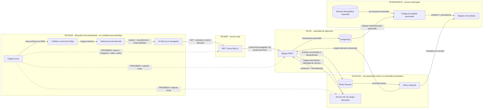

# ADR-0001 — Arquitectura objetivo de VisionClass

- **Estado:** CANDIDATA — BLOQUEADA POR G0
- **Fecha:** 2026-09-14
- **Propietario técnico:** `tesista_operador`
- **Aprobadores requeridos:** liderazgo técnico independiente, privacidad, metodología e instancia institucional/ética según el componente
- **Dependencia:** Puerta G0 aprobada
- **Revisión prevista:** al reconsiderar G0 y antes de cualquier cambio de frontera, proveedor o categoría de datos

## Decisión y límite de autoridad

VisionClass adoptará una arquitectura Edge donde el navegador captura y procesa localmente el material visual. En el modo predeterminado no transmite ni persiste frames, imágenes, video, audio o blobs equivalentes. El backend Django es la única autoridad para identidad y autorización. Los servicios ML, Redis, el motor temporal y el frontend no deciden quién es una persona ni qué recursos puede consultar.

Este ADR fija una **arquitectura candidata** para orientar PR posteriores. G0 continúa `BLOQUEADA`, hay cero participantes autorizados y no se autoriza reclutamiento, datos reales, piloto o despliegue. La aprobación del ADR requiere revisión independiente; la firma del ejecutor técnico no la sustituye.

## Contexto comprobado

- El frontend actual es Next.js y conserva JWT; usa un cliente API y rutas proxy.
- Django REST concentra identidad, autorización, contratos y persistencia relacional.
- El servicio ML actual es FastAPI y no constituye una frontera confiable de identidad.
- PostgreSQL es la fuente relacional prevista. Redis Streams, archivos, exports, checkpoints y volúmenes no son fuentes compartidas de verdad.
- El flujo D2R actual tiene dependencias en frontend, backend, métricas, exportadores, navegación, migraciones y ML.
- P0.2 exige que, por defecto, ningún material visual crudo salga del dispositivo.
- El formulario G0 adopta una tarea propia de cancelación visual, histórico D2R en solo lectura y retiro final en PR41.

## Diagrama lógico

Las flechas punteadas marcadas `PROHIBIDO` son controles negativos: no describen flujos permitidos.

## Componentes, entradas, salidas y propietarios

La matriz normativa y procesable está en [COMPONENTES_ARQUITECTURA.csv](COMPONENTES_ARQUITECTURA.csv). Todo componente debe cumplir estas reglas:

| Componente | Entrada permitida | Salida permitida | Propietario | Límite de confianza |
| --- | --- | --- | --- | --- |
| Navegador Edge | permiso y consentimiento vigente, frames efímeros, interacción de tarea | rasgos mínimos, métricas de tarea, estado de observabilidad | frontend/Edge | no es autoridad de identidad; entorno controlado por participante |
| BFF Next.js | solicitud web y JWT | solicitud normalizada al backend | frontend | no concede permisos ni confía en IDs del cliente |
| Django REST | JWT, identidad de servicio, contratos versionados | respuesta autorizada, evento y persistencia | backend/seguridad | única autoridad de autenticación y autorización |
| Redis Streams | eventos derivados versionados | entrega con ack, pending y DLQ solo para eventos no visuales críticos | plataforma/backend | transporte durable; no fuente de verdad ni almacén de frames |
| Motor temporal | secuencia autorizada y estado anterior | estado derivado, incertidumbre y versión | ML/investigación | no diagnostica ni decide consecuencias educativas |
| PostgreSQL | transacciones autorizadas | datos relacionales y eventos aceptados | backend/custodio | fuente de verdad de aplicación; separación por finalidad |
| Registro de modelos | artefacto, configuración, hashes y métricas aprobadas | versión reproducible y estado de promoción | ML | no contiene identidades ni autoriza despliegue |
| Bóveda demográfica | atributos voluntarios, consentidos y seudonimizados | unión controlada para auditoría | privacidad/custodio | acceso separado; nunca condiciona acceso o intervención |
| Servicio ML | rasgos derivados mínimos e identidad de servicio | predicción, incertidumbre y estado `unknown` | ML/seguridad | no acepta material crudo por defecto ni identidad del cliente |

## Datos permitidos y prohibidos

### Pueden salir del dispositivo cuando exista consentimiento vigente

- Identificador opaco de sesión emitido y validado por el backend.
- Versión del contrato, fase, timestamp técnico acotado e idempotency key sin PII.
- Métricas de tarea TA, C, O, precisión, exhaustividad, `F1_tarea` y CON con unidades explícitas.
- Rasgos visuales mínimos autorizados, estado `no_observable`/`unknown`, calidad, incertidumbre y cobertura.
- Autoinforme separado y únicamente para la finalidad consentida.
- Métricas operativas agregadas sin payload, token, ruta personal o cuasiidentificador.

### Nunca pueden salir en el modo predeterminado

- Frames, capturas, fotografías, video, audio, crops faciales o blobs reconstruibles.
- Plantillas biométricas, embeddings orientados a identificación o datos para reconocimiento facial.
- Contraseñas, JWT, cookies, credenciales ML o secretos en logs, eventos o métricas.
- Documento de identidad, fecha de nacimiento completa, matrícula, correo o nombre dentro de eventos ML.
- Datos demográficos unidos de forma permanente a eventos operativos o visibles a docentes.

### Nunca se usan para decisiones operativas

- Diagnóstico, sanción, calificación, asistencia, disciplina, integridad académica o causalidad de abandono.
- Predicciones visuales individuales para restringir contenido, acceso o relación académica.
- `no_observable`, ausencia de cámara o falta de respuesta como evidencia de baja atención.
- Atributos demográficos para personalización, ranking o intervención.

## Identidad, secretos y acceso

1. El navegador presenta JWT al BFF; el BFF lo propaga y puede normalizar transporte, pero no interpreta el rol como autorización final.
2. Django deriva usuario, rol, institución, curso y propiedad desde la identidad autenticada y relaciones persistidas. Rechaza valores de autoridad enviados por el cliente.
3. El servicio ML usa una credencial máquina a máquina con alcance `events:create` para sesiones autorizadas. No administra usuarios, cursos, roles ni exports.
4. Secretos viven en el gestor del proveedor, con mínimo privilegio, rotación y revocación. Nunca se incorporan a imágenes, JavaScript cliente, repositorio, logs o mensajes.
5. Acceso de investigación, bóveda, exports y eliminación queda auditado y separado del acceso operativo. Docentes reciben únicamente agregados autorizados.

## Contratos y estado distribuido

- Los contratos de API y eventos se versionan; durante una transición, productores y consumidores aceptan la versión anterior documentada.
- Todo evento durable incluye versión, idempotency key, correlación opaca, fecha de emisión y procedencia sin PII.
- Redis define ack, pending, reintentos, expiración y DLQ. Frames no tienen reintento, persistencia ni DLQ.
- PostgreSQL conserva la confirmación transaccional. Redis, memoria de proceso y archivos locales nunca sustituyen esa confirmación.
- El motor temporal persiste checkpoints derivados con versión; ante señal insuficiente devuelve `unknown` o `no_observable`.
- Una respuesta HTTP 200 con `ok=false` no es éxito. La UI diferencia procesando, confirmado, degradado y error.

## Despliegue y operación

Render es una opción provisional, sin autorización de despliegue en este ADR. Región, contrato, cifrado, IAM, capacidad, backup, RPO/RTO y restore deben comprobarse antes de datos reales. El frontend público solo alcanza el BFF/API autenticados; Redis, PostgreSQL, motor temporal, bóveda y administración permanecen en redes o controles privados.

El apagado debe detener captura en 5 minutos, aislar servicios en 15 minutos y permitir rollback de aplicación en 30 minutos. Estas cifras son requisitos P0.4 no demostrados. Sin suplente disponible no puede abrirse una sesión real.

## Secuencia de migración D2R

1. **PR01:** registrar esta arquitectura candidata y mantener G0 bloqueada.
2. **PR03:** cerrar elevación de rol, propiedad de recursos y vínculos JWT.
3. **PR07:** formalizar protocolo, consentimiento separado, revocación y alternativa sin cámara.
4. **PR02:** retirar D2R del flujo principal mediante transición reversible; conservar histórico en solo lectura.
5. **PR04–PR06:** mínimo privilegio ML, control de captura/envíos y errores observables.
6. **PR08–PR10:** separar observaciones/estados, registrar artefactos y versionar eventos.
7. **PR11–PR18 y PR33:** incorporar estado distribuido, retención, bóveda, extracción Edge, normalización, calidad y perfiles.
8. **PR19–PR28 y PR32–PR34:** modelado y evaluación solo después de G3, con holdout, calibración, cobertura y equidad.
9. **PR35–PR40:** producto, operación y piloto solo después de sus gates y aprobaciones.
10. **PR41:** archivar D2R cuando se demuestre independencia, retención y rollback; no eliminar histórico antes de ese hito.

Cada paso debe conservar compatibilidad o documentar migración, feature flag, observabilidad y rollback. Ningún paso hereda aprobación de este ADR candidato.

## Alternativas descartadas

| Alternativa | Motivo de descarte |
| --- | --- |
| Mantener D2R como onboarding obligatorio y usar sus percentiles | No hay licencia/equivalencia documentada; mezcla tarea propia con baremos no sustentados y acopla autenticación al instrumento. |
| Enviar frames al servicio ML remoto por defecto | Viola minimización y la regla aprobada de procesamiento local; amplía daño, proveedores y superficie de secretos. |
| Autorizar identidad en BFF, ML o campos `user_id` del cliente | Permite suplantación y políticas divergentes; Django debe ser la autoridad única. |
| Usar memoria local del proceso como estado compartido | Pierde estado, mezcla sesiones y diverge al escalar; se requiere estado versionado y persistencia apropiada. |
| Guardar demografía junto con eventos operativos | Facilita acceso indebido, reidentificación y usos no consentidos; la bóveda debe estar separada. |
| Activar simultáneamente Render y Cloud Run | Duplica destinos, secretos y obligaciones sin necesidad demostrada; solo puede existir un proveedor activo aprobado. |

## Consecuencias

### Favorables

- Reduce la exposición de material visual y concentra autorización en una frontera comprobable.
- Permite sustituir D2R sin perder trazabilidad histórica ni confundir una referencia interna con un baremo.
- Separa datos operativos, investigación, demografía y artefactos de modelos.
- Hace explícitos contratos, idempotencia, observabilidad, fallback y responsabilidades.

### Costes y restricciones

- Exige extracción Edge, contratos versionados, Redis, bóveda y registro de modelos antes de escalar.
- Requiere compatibilidad gradual con el legado D2R y más pruebas negativas.
- El único ejecutor técnico es un cuello de botella; sin suplente no se permiten sesiones reales.
- Render, SLO, backup y rollback siguen siendo propuestas hasta obtener evidencia.

## Riesgos y tratamiento mínimo

| Riesgo | Escenario | Tratamiento y PR |
| --- | --- | --- |
| Autorización divergente | BFF o ML confía en rol/ID cliente | Django como autoridad y negativos en PR03–PR04 |
| Material crudo sale del Edge | captura actual llama a servicio remoto | prueba de red y extracción local en PR05/PR15 |
| Pérdida o duplicación de eventos | reentrega, timeout o varias instancias | contratos/idempotencia/Streams en PR10–PR13 |
| Inferencia presentada como atención | score visual se muestra como verdad | separación, incertidumbre y `no_observable` en PR08/PR17 |
| Cruce demográfico operativo | atributos influyen en acceso o intervención | bóveda y auditoría en PR33–PR34 |
| Retirada incompleta | datos reaparecen desde export o backup | linaje, eliminación y restore en PR14 |
| Migración D2R irreversible | se elimina histórico antes de independencia | solo lectura, flag de transición y retiro en PR41 |
| Proveedor no ratificado | región/contrato/restore desconocidos | no desplegar; evidencia en G04-1/G04-2/G04-8 |

## Rollback

Mientras el ADR siga candidato, rollback consiste en revertir este documento, la matriz asociada y las referencias del backlog, y emitir una nueva versión. No hay código, esquema, dato ni infraestructura que restaurar. Una revisión futura debe conservar el historial de esta decisión y explicar el cambio.

## Criterios de aceptación

- [x] Diagrama con navegador Edge, BFF, Django, Redis Streams, motor temporal, PostgreSQL, registro de modelos y bóveda demográfica.
- [x] Cada componente declara entrada, salida, propietario, fuente de verdad y límite de confianza.
- [x] Datos permitidos, prohibidos y excluidos de decisiones operativas están explícitos.
- [x] Flujo Edge prohíbe transmisión y persistencia de material visual crudo por defecto.
- [x] Identidad, secretos, acceso, eventos y estado distribuido tienen autoridad definida.
- [x] Migración D2R enlaza PR posteriores y preserva histórico hasta PR41.
- [x] Alternativas, consecuencias, riesgos y rollback están documentados.
- [ ] G0 aprobada y revisión cruzada independiente de frontend, backend, ML, investigación y privacidad registrada.

## Referencias

- [P0.1 — Línea base](../P0.1/INFORME.md)
- [P0.2 — Privacidad y amenazas](../P0.2/INFORME.md)
- [P0.3 — Constructo y protocolo](../P0.3/INFORME.md)
- [P0.4 — Umbrales y suspensión](../P0.4/INFORME.md)
- [P0.5 — Plan y gobernanza](../P0.5/INFORME_P0.5.md)
- [Decisiones G0 saneadas](../G0/DECISIONES_G0_SANITIZADAS.md)
- [Acta G0](../G0/ACTA_G0.md)
- [Catálogo PR01–PR41](../P0.5/CATALOGO_PR.md)
